# SWENG 837 Project: AI Travel Planner Agent Web Application

**Date:** 12/07/2025
**By:** Tanuj Rane

---

## Tech Stack

### Frontend
* React
* Next.js

### Back end
* Python
* Fast Api
* Lang graph

### External services
* MongoDB Atlas
* OpenWeather API
* Aviationstack API
* Google Maps API
* Exchange rate API
* MongoDB

---

## Business Requirements

### Problem Statement
Planning trips can be very challenging and time-consuming, involving figuring out the destination, transportation, activities, and weather. Travelers also need to know the cost and whether it fits their budget. This complexity can deter travelers, leading them to stay home instead of planning a trip. The system's goal is to reduce the challenges and time spent planning a trip.

This system will be an **AI travel planning agent web application** that collects data (user preferences, weather, flights, points of interest, costs) and uses artificial intelligence to generate weather- and preference-aware travel plans and itineraries tailored to the user.

### Target Users and Their Needs
The target users are travelers or individuals planning a vacation/trip who need assistance. They need a system will gather information quickly and create a travel plan to save time.

### System Functionalities
The system needs to provide the following functionalities:

* **Authentication**
    * Logging in with Google Oauth
    * Maintain the authentication for the user (traveler)
* **User preferences**
    * Stores the users' base travel preferences such as (climate, activity types, pace) (ex, somewhere warm and relaxing, suitable for family)
    * Reuse preference for future trips.
* **AI-assisted trip planning**
    * Collect user origin location, destination, date range, budget, and preferences.
    * Optional selection of transportation mode (flights only, drive only, or both)
    * Gather data from external API:
        * weather forecast (open weather)
        * flights options (Aviationstack)
        * driving routes (google directions)
        * points of interest (attraction restaurants landmarks) (Google Places)
        * current exchange rates (exchange rate-Api)
    * Use AI (langraph + OpenAI) to:
        * Optionally analyze the feasibility and suitability of the trip plan.
        * Summarize key points.
        * The good and the trade-offs.
* **Weather view**
    * Show detailed destination forecasts for select dates.
    * Allow charts or a summarized daily breakdown.
* **Tranportation/flight search**
    * Show flight options if available.
    * Show driving distance/time if possible.
* **AI Itinerary generation**
    * Once confirmed, the AI agent will build a day-by-day itinerary, taking into account:
        * weather conditions
        * travel time
        * user preferences
        * point of interest
        * Explains decisions (ex-It's going to be raining so going to a museum might be a good choice for that).
* **Trip management**
    * Allows the user to save, view, and delete trips and itineraries in MongoDB Atlas.
* **Frontend**
    * Provide a responsive web UI experience:
        * login
        * plan trips
        * View transportation options for the planned trip.
        * Review and generate itineraries.
        * Manage saved trips.

### Actor Description Table
The following table describes the primary, supporting, and offstage actors:

| Type | Actor | Goal Description |
| :--- | :--- | :--- |
| Primary | Traveler (user) | Log in through Google OAuth, able to use the AI system to plan trips, view weather forces, generate an itinerary, save/delete trips, and view previous saved trips. |
| Supporting | Mongo DB | Stores users' data, such as profiles, preferences, and saved trips/itineraries. And AI response. |
| Supporting | Google Oauth | Authenticate users securely using Google login. |
| Supporting | OpenWeather API | Provides current weather and forecast data for destination and date range. |
| Supporting | Aviationstack Flight APi | Provide flight options and prices. |
| Supporting | Google Maps Apis (Geocoding, places) | Provides data such as locations, points of interest (attractions, restaurants, and hotels), and images and routes. |
| Supporting | Exchange rate APi | Provide exchange rate data for users traveling to different countries. For example, a user from the USA want to know the exchange rate for Japanese currency. |
| Supporting | Open AI | Provide LLM Ai reasoning. |
| Offstage | Airlines | Airlines can affect the price of airline tickets and cancel flights, which can end up affecting the system results. |
| Offstage | Weather stations/provider | These affect the forecast date that OpenWeather API provides. |
| Offstage | Local businesses | Can be the point of interest data (attraction, restaurant, and landmarks). |

### Business Goals the System Should Support
| Goal | How System Supports Goal |
| :--- | :--- |
| Reduce time spent planning a trip | The system will use external APIs to gather data such as weather, transportation, points of interest, and current conditions. And the AI agent will use that data to create a travel plan and itinerary. |
| Improve the user confidence in the trips plan | The system will take into account the weather and cost, budget, and user preference when making its decision. |
| Show that AI can assist with trip planning when given the proper tools | The system will use open ai and the external Api tools to create travel plans and itineraries tailored to the user. |

---

## Non-Functional Requirements (NFR)

If the system were to go into production service, the following would be the Non-Functional Requirements.

### Performance Requirements

| NFR Type | NFR Description |
| :--- | :--- |
| scalability | The System should support a wide range of active users, at least 100, without any noticeable performance issue. The backend running on Google Cloud Run should auto-scale when needed. |
| response time | The system should complete a trip plan request with less than or at most a minute (30s -60s); a progress bar should be present to show how long is left. |
| throughput | For small project scenarios with limited resources, the system should be able to process 10 trip planning requests in 5 min. |

### Security Requirements

| NFR Type | NFR Description |
| :--- | :--- |
| authentication | All user authentications will be done through google oauth. |
| authorization | Data such as trip plan and itinerary will all have a user id associated with it so only the user associated with the data may access it. |
| data encryption | All data traffic will be done using HTTPS and TLS to keep data secure, and all Api keys and secrets will be stored securely as environment variables. |

### Maintainability Requirements

| NFR Type | NFR Description |
| :--- | :--- |
| code modularity | The system will have a clear separation for frontend and backend (controller, service, AI agent, and repository) code. Keep everything in its own place, easy to organize and maintain the code and change it when needed. For example, if an external Api changes, we will just need to update the services that call the Api. |
| documentation | The code will have necessary comments. A swagger will be created for the backend endpoints, and a readme explaining the system and architecture, along with this system design document. |
| testing | Front end and backend will both have their respective test cases to ensure proper functionality. |

### Other Non-Functional Requirements

| NFR Type | NFR Description |
| :--- | :--- |
| Observability | Basic logging will be added for both troubleshooting and testing purposes in both backend and frontend. |

---

## Use Cases

The following are main use cases the system will need to meet the main requirements: Login, Logout, Manage travel preferences, Plan trip, View weather forecast, View points of interest, Search transportation (flight/driving Info), View trip summary, AI generated itinerary, and Manage Trips (Save / View / Delete).

### UC1: User Login

| Use case selection | Comment |
| :--- | :--- |
| Use Case Name | Uses login |
| Scope | AI travel planning agent system |
| Level | User goal |
| Primary Actor | User(traveler) |
| Stakeholders and Interests | Able to login securely and easily |
| Pre-conditions | User has a valid google account, User selects login button in Ui |
| Success guarantee (success end condition) | user is authenticated using google Oauth  User record is created, updated or retrieved from MongoDB  Users obtain active JWT session |
| Main success scenario | 1. User opens the application, clicks sign in with google  2. System redirects the user to the google oath  3. Used reviews and approve consent screen  4. Google redirects use back to the system with an authorization token  5. Will add or update the users record in mongo db. Atlas  6. Backend creates a JWT session  7. User will be redirected to the main page |
| Extensions | * 3a. Uses cancels at google; the system will then show login cancelled  * 5a authentication fails; the system logs error and shows user error message and prompts them to try again |
| Special requirements | Secure oauth token, Session expires after a long period of inactivity |
| Technology & data variation list | Google oauth, MongoDB atlas |
| Frequency of occurrence | Every login session |
| Open issues/miscellaneous | N/A |

### UC2: Manage travel preferences

| Use case selection | Comment |
| :--- | :--- |
| Use Case Name | Manage travel preferences |
| Scope | AI travel planning agent |
| Level | User goal |
| Primary Actor | User |
| Stakeholders and Interests | User wants to add stored preferences, so they do not have to keep repeating certain choices  The system wants to use the user preference to improve the AI reasoning and results |
| Pre-conditions | User is logged in |
| Success guarantee (success end condition) | Preferences for this user (activity types, climate preferences, pace, budget range) are stored in mongo db. atlas and available for use in other use cases. |
| Main success scenario | 1. Users navigate to preference in the web Ui  2. System displays current stored preferences (if any are available)  3. User updates fields (e.g. Museums food trip, mild climate, moderate pace)  4. User clicks save  5. Inputs are validated in the backend and updated in mongo dB  6. System confirms that user's preferences are saved |
| Extensions | * 5a. Validation fails (invalid input), System will highlight the error and ask for correction |
| Special requirements | Preferences should be well structured and clear so they can be passed directly to the Lang Graph AI agent so that it can utilize its tools more efficiently. |
| Technology & data variation list | Python langraph, MongoDB atlas |
| Frequency of occurrence | Whenever user wants to update their preferences |
| Open issues/miscellaneous | N/a |

### UC3: Plan trip

| Use case selection | Comment |
| :--- | :--- |
| Use Case Name | Plan trip |
| Scope | AI travel planning agent |
| Level | User goal |
| Primary Actor | User |
| Stakeholders and Interests | Users want a quick overview of whether the trip is possible and appealing, and meets their preferences |
| Pre-conditions | User is logged in, Destination, date range provided and Optional budget |
| Success guarantee (success end condition) | A trip plan summary is generated that combines weather transportation options (flights and /or driving if applicable), points of interest, and currency information.  This summary, if the user likes, it can be used for itinerant generation. |
| Main success scenario | 1. User on the plan trip page  2. Users fills form and enter:  &nbsp;&nbsp;&nbsp;&nbsp;a. Origin location  &nbsp;&nbsp;&nbsp;&nbsp;b. Destination  &nbsp;&nbsp;&nbsp;&nbsp;c. Start/end dates (return date)  &nbsp;&nbsp;&nbsp;&nbsp;d. Budget  &nbsp;&nbsp;&nbsp;&nbsp;e. Preferences (filled with stored preferences or user can add new preferences)  &nbsp;&nbsp;&nbsp;&nbsp;f. Transportation (flight, drive or both (default))  3. Use clicks plant trip button  4. Front ends send request op to back  5. Backend geocodes the destination using google maps geocoding  6. Backend requests a forecast from open weather for the destination and dates  7. Backend checks for transport:  &nbsp;&nbsp;&nbsp;&nbsp;a. If flights: call Aviationstack to search flights  &nbsp;&nbsp;&nbsp;&nbsp;b. If driving: calls google direction to estimate route and travel time  8. Backend requests Points of Interest (attractions, restaurants, landmarks) from Google Places.  9. Backend requests a currency rate from exchange rate Api (home currency to destination)  10. Backend then uses Lang graph and OpenAI to:  &nbsp;&nbsp;&nbsp;&nbsp;a. Analyze the combined data  &nbsp;&nbsp;&nbsp;&nbsp;b. Highlight good and bad days  &nbsp;&nbsp;&nbsp;&nbsp;c. Suggest whether the trip window looks reasonable  11. Backend aggregates all data into trip plan summary (weather, POIs, transport options, budget indicators, AI comments) and returns it  12. Frontend displays the trip plan summary to the user |
| Extensions | * 4a. If weather Api fails, the plan is returned with partial data and a warning about missing forecast  * 5a. Flight Api returns no flights; the Ui indicates that no flights were found for the given dates  * 7a. Currency Api fails; the Ui will indicate that conversion is unavailable. |
| Special requirements | Failures to external Api should not break the system but return the partial result or the necessary error message |
| Technology & data variation list | Lang graph, MongoDB atlas, Open AI, OpenWeather API, Aviationstack API, Google Maps API, Exchange rate API, MongoDB |
| Frequency of occurrence | Whenever user tries to plan for a trip |
| Open issues/miscellaneous | n/a |

### UC4: View weather forecast

| Use case selection | Comment |
| :--- | :--- |
| Use Case Name | View weather forecast |
| Scope | AI travel planning agent |
| Level | subfunction |
| Primary Actor | User |
| Stakeholders and Interests | Users: View the weather forecast for the planned trip |
| Pre-conditions | user is logged in., Trip planned generated (UC3). |
| Success guarantee (success end condition) | Detailed weather forecast shown for destination and selected dates |
| Main success scenario | 1. Users select weather preview for more details for the planned trip  2. Frontend send request to the back end  3. Backend load trip destination and date range from mongo db. atlas  4. Backend calls open weather Api with destination coordinates and dates  5. Open weather return forecast data  6. Backend returns structured forecast to the frontend  7. Frontend displays the daily forecast showing temperature, precipitation, chances of, and condition, (possibly in chart formant) |
| Extensions | * 4a. Forecast unavailable or error then System shows an error message and suggests retrying later. |
| Special requirements | If failed request to external api should retry 3 times |
| Technology & data variation list | MongoDB atlas, OpenWeather API |
| Frequency of occurrence | Whenever user wants to view planned trip weather forecast |
| Open issues/miscellaneous | N/a |

### UC5: Search transportation (flight/driving Info)

| Use case selection | Comment |
| :--- | :--- |
| Use Case Name | Search transportation (flight/driving Info) |
| Scope | AI travel planning agent |
| Level | subfunction |
| Primary Actor | User |
| Stakeholders and Interests | User want to know transportation to planned trip destination |
| Pre-conditions | user is logged in., Trip planned generated (UC3). |
| Success guarantee (success end condition) | Transportation option given to the user (flights and/or driving route estimates) |
| Main success scenario | 1. User opens transportation option in the planned trip  2. Frontend sends request to back end  3. Backend loads the planned trip origin/destination/dates from MongoDB Atlas.  4. If flights requested:  &nbsp;&nbsp;&nbsp;&nbsp;a. Backend calls Aviationstack API for flights between origin and destination for the date range.  5. If driving requested:  &nbsp;&nbsp;&nbsp;&nbsp;a. Backend calls Google Directions for driving time and distance.  6. Backend returns a combined transport options response.  7. Frontend shows flights (if any) and driving summary side-by-side if possible. |
| Extensions | * 4a. Aviationstack API returns no flights. It should only show drive option with a message explaining why there is no flight option  * 4b. If neither flight nor driven route is possible, an error message will appear |
| Special requirements | If a failed request to external Api should retry 3 times, |
| Technology & data variation list | Aviationstack API, Google Maps API, MongoDB atlas |
| Frequency of occurrence | Whenever user wants to view transportation option for planned trip |
| Open issues/miscellaneous | N/A |

### UC6: Viewpoints of interest

| Use case selection | Comment |
| :--- | :--- |
| Use Case Name | Viewpoints of interest |
| Scope | AI travel planning agent |
| Level | subfunction |
| Primary Actor | User |
| Stakeholders and Interests | User to view planned trip point of interest |
| Pre-conditions | user is logged in., Trip planned generated (UC3). |
| Success guarantee (success end condition) | User can see a list of point of interest (attractions, restaurants, landmarks) and details about them for the planned trip |
| Main success scenario | 1. Traveler clicks “Viewpoints of Interest” on a planned trip.  2. Frontend makes a request to the backend  3. Backend will then use the place id that was obtained in UC3 to get more detailed info on the place of interest  4. Backend calls Google Places nearby for the place.  5. Backend returns POIs (name, type, rating, address).  6. Frontend shows a list and possibly a map of Points of Interest. And three details |
| Extensions | * 4a. No point of inters found; the system will display an appropriate error message |
| Special requirements | Attempt 3 times if failed. |
| Technology & data variation list | Google Maps API, MongoDB atlas |
| Frequency of occurrence | Whenever user wants to view |
| Open issues/miscellaneous | n/a |

### UC7: View trip summary

| Use case selection | Comment |
| :--- | :--- |
| Use Case Name | View trip summary |
| Scope | AI travel planning agent |
| Level | subfunction |
| Primary Actor | User |
| Stakeholders and Interests | View the overall trip summary including weather summary, transport options, Points of Interest, and budget hints. |
| Pre-conditions | user is logged in., Trip planned generated (UC3). |
| Success guarantee (success end condition) | Users can view an overview of the selected trip, including weather summary, transport options, Points of Interest, and budget. |
| Main success scenario | 1. Traveler opens My Trips and selects one trip.  2. Frontend will make a request to backend  3. Backend queries MongoDB Atlas for trip, plan summary, and itinerary (if exists).  4. Backend returns a combined Trip Summary DTO.  5. Frontend displays overview cards: dates, destination, weather summary, recommended transport, Points of Interest highlights, and, if available, a link to an itinerary. |
| Extensions | * 4a. Return error if open ai fails |
| Special requirements | Try 3 times if failed |
| Technology & data variation list | MongoDB, OpenAI |
| Frequency of occurrence | Whenever user wants to view the summary of the planned trip |
| Open issues/miscellaneous | N/a |

### UC8: AI generated itinerary

| Use case selection | Comment |
| :--- | :--- |
| Use Case Name | AI generated itinerary |
| Scope | AI travel planning agent |
| Level | User goal |
| Primary Actor | User |
| Stakeholders and Interests | Users want a clear, day-by-day itinerary tailored to preferences and weather. |
| Pre-conditions | user is logged in., Trip planned generated (UC3). |
| Success guarantee (success end condition) | A structured itinerary (with day-by-day activities and explanation text) is generated and saved to MongoDB Atlas. |
| Main success scenario | 1. User clicks “Generate Itinerary” on a planned trip.  2. Frontend sends requests to the back end.  3. Backend loads of trip, preferences, weather summary, Points of Interest, and any chosen transport from MongoDB Atlas (or recompute missing parts).  4. Backend prepares a LangGraph input object and calls Open ai  5. Lang graph and OpenAI AI Travel:  &nbsp;&nbsp;&nbsp;&nbsp;a. calls OpenAI API with a structured prompt including weather, POIs, transport, preferences  &nbsp;&nbsp;&nbsp;&nbsp;b. may call tools again (weather, maps, currency) if needed for small refinements  &nbsp;&nbsp;&nbsp;&nbsp;c. composes an itinerary and explanation text  6. AI Travel returns an Itinerary with Itinerary Day items.  7. Backend saves the itinerary to MongoDB Atlas.  8. Backend returns the itinerary to the frontend.  9. Frontend displays the itinerary in a day-by-day view. |
| Extensions | * 5a. OpenAI API fails; the System returns an error message and suggests retrying later.  * 7a. DB error while saving; the Itinerary is returned but not stored; system shows a warning. |
| Special requirements | Try 3 times if failed |
| Technology & data variation list | Mongo, Open ai |
| Frequency of occurrence | Whenever user views itinerary |
| Open issues/miscellaneous | N/a |

### UC9: Manage Trips (Save / View / Delete)

| Use case selection | Comment |
| :--- | :--- |
| Use Case Name | Manage Trips (Save / View / Delete) |
| Scope | AI travel planning agent |
| Level | User goal |
| Primary Actor | User |
| Stakeholders and Interests | User wants to view save and planned trips |
| Pre-conditions | Traveler is logged in. |
| Success guarantee (success end condition) | User can perform CRUD operation save planned trips |
| Main success scenario | **Save Trip:**  1. After planning a trip or generating an itinerary, user clicks “Save Trip”.  2. Frontend sends save request to backend  3. Backend validates the request and inserts/updates the trip in MongoDB Atlas, linked to the user ID.  4. System returns confirmation.  **View Trips:**  5. User opens My Trips.  6. Frontend get request to backend  7. Backend queries from MongoDB Atlas for all trips belonging to the user.  8. System returns a list of trips; front end displays them.  **Delete Trip**  9. User clicks “Delete” on a trip.  10. Frontend sends DELETE request to backend  11. Backend deletes the trip document (and related itinerary) from MongoDB Atlas.  12. Frontend updates the list and confirms deletion. |
| Extensions | If a trip doesn't exist or an error occurs, send the appropriate message |
| Special requirements | N/a |
| Technology & data variation list | Mongo db |
| Frequency of occurrence | Whenever use wants to view, save or delete planned trips |
| Open issues/miscellaneous | n/a |

---

## Design Documentation

### UML Diagrams
The use case and System sequence diagram visualizes how the main and supporting actor interact with the system to support the system use cases.

* **UML Use Case Diagram**
     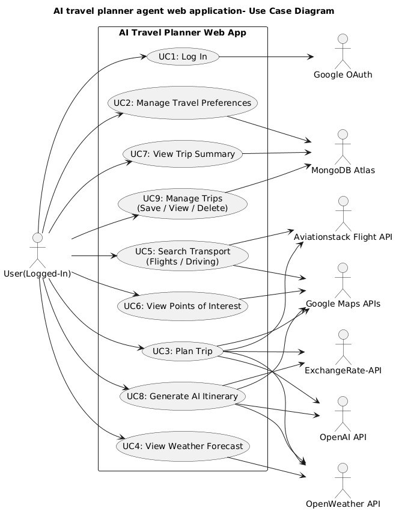
* **System Sequence Diagram**
    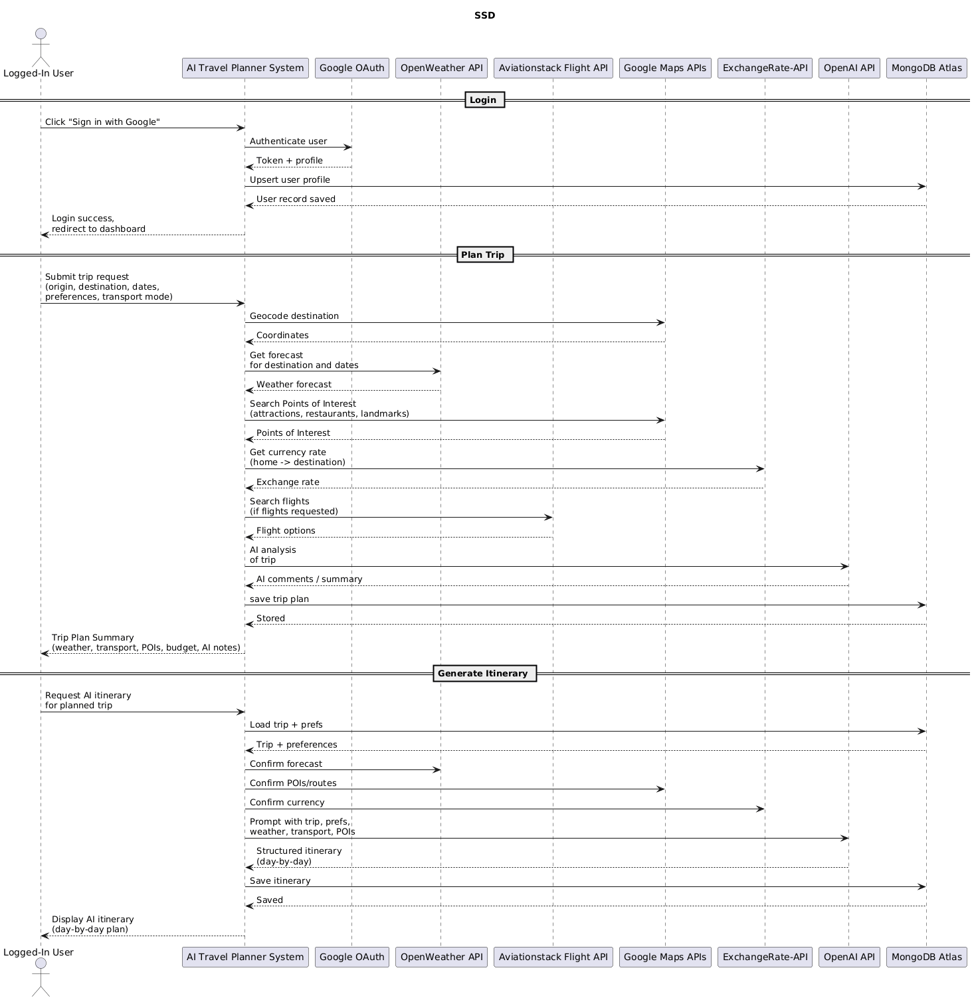

### UML Domain Model
The table below shows the conceptual classes that can be used in the system domain.

| Conceptual Class Category | Example from Restaurant recommendation system |
| :--- | :--- |
| Physical or Tangible Objects | Trips, attraction Landmark |
| Specifications, Designs or Descriptions of Things | Trip detail, itinerary, transportation option |
| Places | Destination city, coordinates, countries, address |
| Transactions | Trip planning request, itinerary creation |
| Transaction Line Items | Planned trip, AI itinerary generated |
| Roles of People | User/traveler |
| Containers of Other Things | Trip (contains itinerary, Points of Interest, transport options) |
| Things in a Container | Itinerary Day, attraction, flight option, weather forecast |
| Other Computers/Systems (external) | OpenWeather API, Aviationstack API, Google Maps Apis, Exchange rate-API, OpenAI API |
| Abstract Noun Concepts | Preferences, WeatherForecast, CurrencyRate |
| Organizations | Air liners, local business owners |
| Events | Trip planned, Itinerary generated, Trip saved, Trip deleted |
| Processes | AI itinerary generation, trip planning workflow |
| Rules and Policies | Budget constraints, weather-based activity rules, user data privacy rules |
| Catalogs | Activity types (restaurant, attraction) |
| Records of Finance, Work, Contracts, Legal Matters, etc. | Budget estimates |
| Financial Instruments and Services | Currency rate for budgeting |
| Manuals, Books, Documents, Reference Papers | Maps, attraction info (from google places) |

| Good Classes (Retained) | Bad Classes (Pruned) |
| :--- | :--- |
| User  Trip  Preferences  Itinerary  Itinerary Day  Location  Weather Forecast  Flight option  Attraction (point of interest)  Currency rate  Trip planned summary | Airlines (off stage actors)  Local business/owners (off stage actors)  Budget rule (rules not domain class)  Weather  AI itinerary generation (process not a domain model)  trip planning workflow (process not a domain model)  Trip saved (process not domain model)  Trip deleted (process not domain model)  user data privacy rules (rules not domain class)  OpenWeather API (external api services)  Aviationstack API (external api services)  Google Maps Apis (external api services)  Exchange rate-API (external api services)  OpenAI API (external api services) |
### UML Domain model 
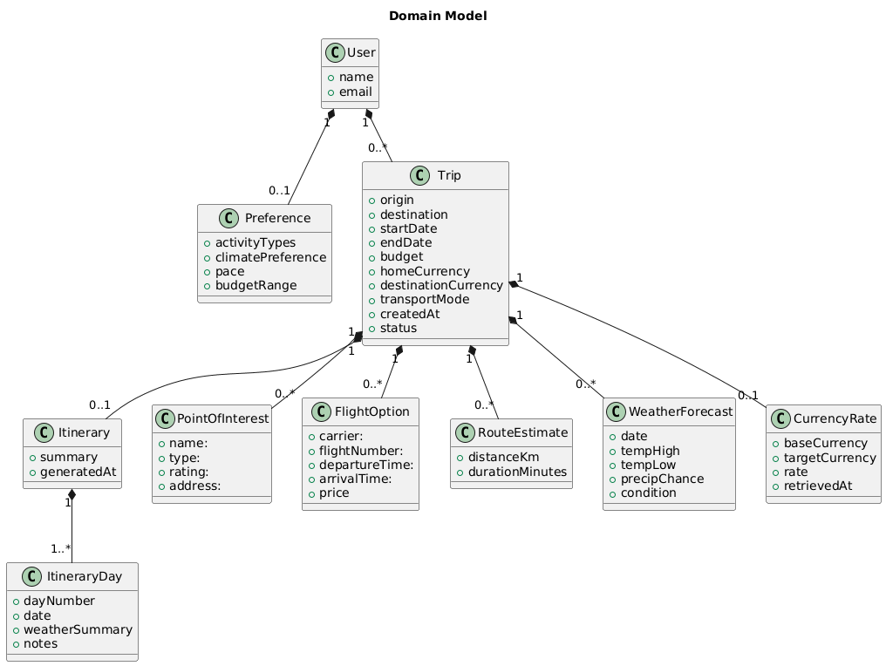
### UML Class Diagram
The class diagrams show all the main classes in the system and their relationship with one another. The UML shows that services handle the external APIs, such as the `WeatherService` being responsible for the OpenWeather API. The `Ai Travel agent` consumes all the service data and sends it to OpenAI to create the trip plan and itinerary.

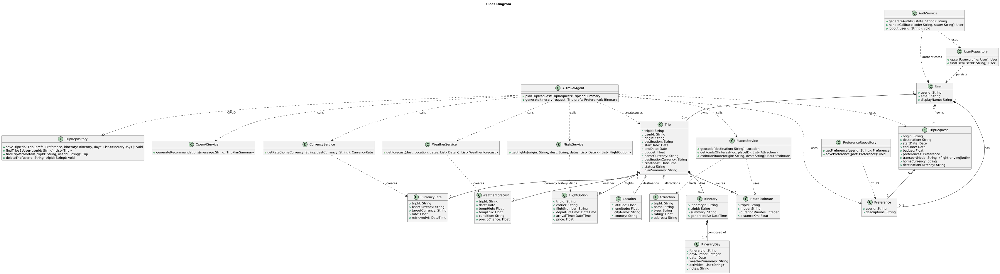

### Sequence Diagrams
This section explains the main system operations, with each having a System Operation Contract and a Sequence Diagram.

#### SD1.1 Login

| Field name | Explain |
| :--- | :--- |
| Name of Operation: | Get Login () |
| Responsibilities: | Redirect user to google Oauth and have user authenticated with their google account |
| Type: | System |
| Cross References: | UC1 |
| Exceptions: | Error invalid account or unauthorized or canceled |
| Pre-conditions: | User clicks “sign in with google “ |
| Post-conditions: | User is logged in and has access to their data |

#### SD 1.2 LogOut

| Field name | Explain |
| :--- | :--- |
| Name of Operation: | Post Logout () |
| Responsibilities: | End users google authenticated session |
| Type: | System |
| Cross References: | UC1 |
| Exceptions: | Error user is not in a valid session |
| Pre-conditions: | User is already logged in and clicks sign out |
| Post-conditions: | User session has ended |

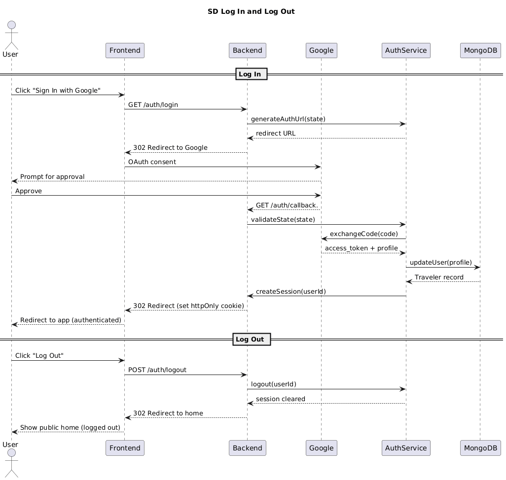

#### SD2 Plan Trip

| Field name | Explain |
| :--- | :--- |
| Name of Operation: | Plan Trip (trip Request), POST /api/trips/plan(TripRequest) |
| Responsibilities: | Validate trip requests and gets geocode destination, fetch weather, flights, driving routes, points of interest, and currency rage and calls open ai to create a trip plan |
| Type: | System |
| Cross References: | UC3, UC4, UC5, UC6 |
| Exceptions: | External Api error will return appropriate error response. |
| Pre-conditions: | User authenticated, user makes request to plan trip |
| Post-conditions: | Users receive tip plans. |

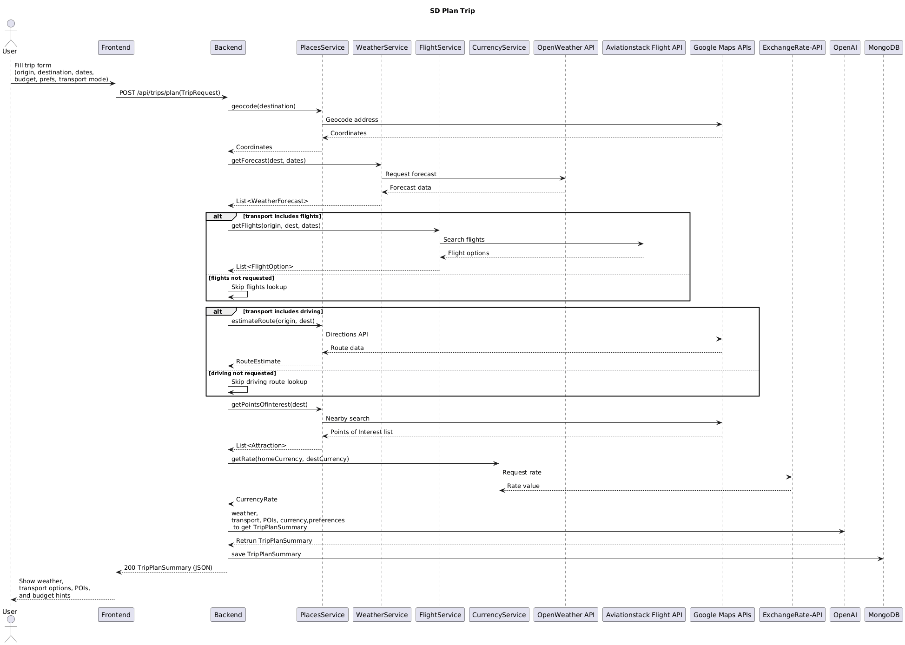

#### SD3 generate Itinerary

| Field name | Explain |
| :--- | :--- |
| Name of Operation: | generate Itinerary (Trip, Preference), POST /api/itineraries/generatIitineraries(ItineraryRequest) |
| Responsibilities: | Load trip and preferences and supporting data; the ai agent will use that data and call OpenAI to create an itinerary for the trip |
| Type: | System |
| Cross References: | UC8 |
| Exceptions: | If there is any missing data, such as trip or external Api error, it will return the appropriate error response |
| Pre-conditions: | Traveler is logged in and Trip exists |
| Post-conditions: | Itinerary is created and saved to MongoDB. |

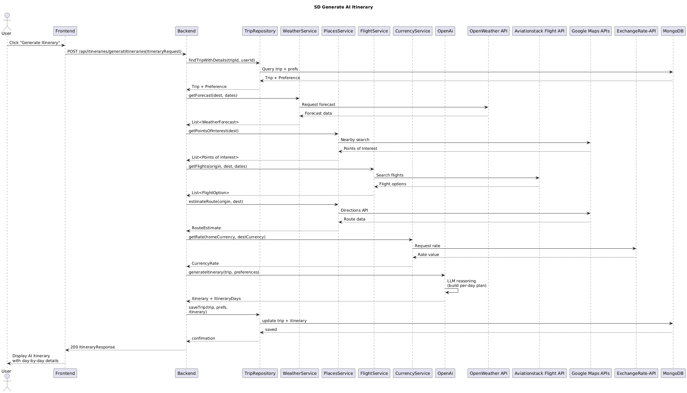

#### SD4 Managed saved Trips

| Field name | Explain |
| :--- | :--- |
| Name of Operation: | Managed saved Trips, Post saveTrip(trip, prefs, itinerary, days), POST /api/trips/save(tripId), findTripsByUser(userId), GET /api/trips, deleteTrip(userId, tripId), DELETE /api/trips/{tripId} |
| Responsibilities: | Perform CRUD operation on the trip |
| Type: | System |
| Cross References: | UC7 |
| Exceptions: | If db. save fails or unauthorized, it will return appropriate error response. |
| Pre-conditions: | User is logged in |
| Post-conditions: | Trips are presented or removed. And user can see updates |

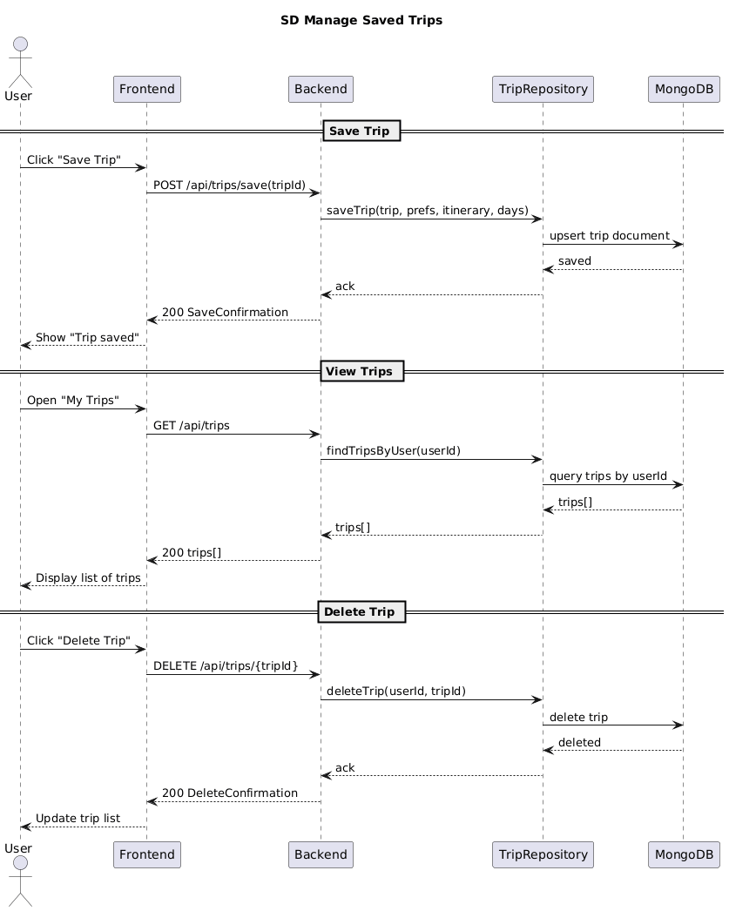

#### SD5 – viewpoints of interest

| Field name | Explain |
| :--- | :--- |
| Name of Operation: | getPointsOfInterest(List<PlaceID>), GET /api/trips/{tripId}/pois |
| Responsibilities: | Retrieve points of interest for the destination using google maps and placed Api |
| Type: | System |
| Cross References: | UC3 |
| Exceptions: | Trip doesn't exist; it will return appropriate error response. |
| Pre-conditions: | User login and trip exist |
| Post-conditions: | point of interest detail returned |

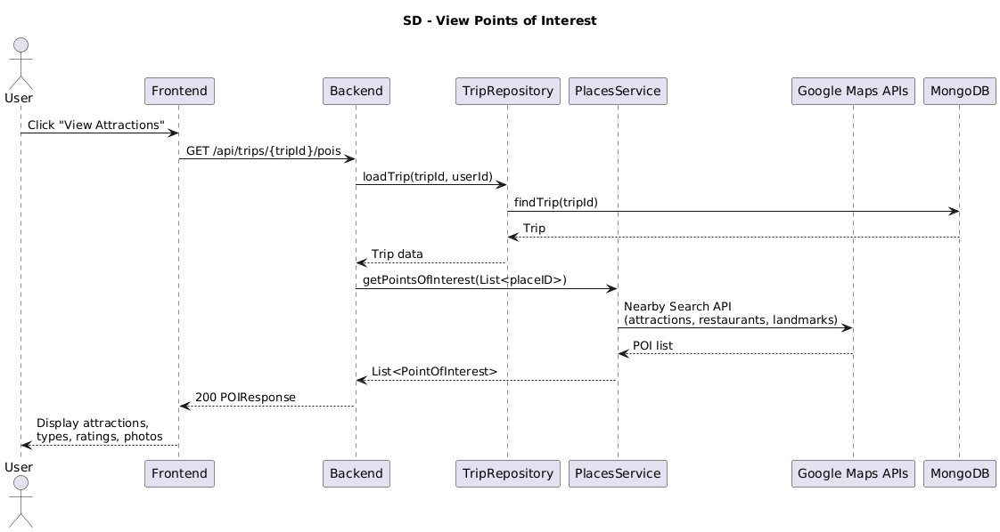

#### SD6 view weather forecasts

| Field name | Explain |
| :--- | :--- |
| Name of Operation: | GET /api/trips/{tripId}/weather, get Forecast (coords, dates) |
| Responsibilities: | Get the weather forecast details for the planned trip. |
| Type: | System |
| Cross References: | UC3 - UC4 |
| Exceptions: | Trip doesn't exist; it will return appropriate error response. |
| Pre-conditions: | User is logged in and trip exist |
| Post-conditions: | Weather details returned to the user |

* 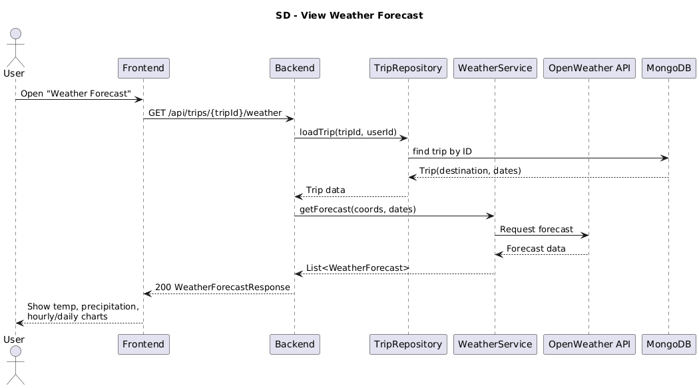

#### SD7- View Transportation

| Field name | Explain |
| :--- | :--- |
| Name of Operation: | GET /api/trips/{tripId}/transport, getFlights(origin, dest, dates), estimateRoute(origin, dest) |
| Responsibilities: | Get transportation option for the planned trip |
| Type: | System |
| Cross References: | UC5 |
| Exceptions: | Trip doesn't exist; it will return appropriate error response. |
| Pre-conditions: | User is logged in and trip exist |
| Post-conditions: | Transportation option returned to the user |

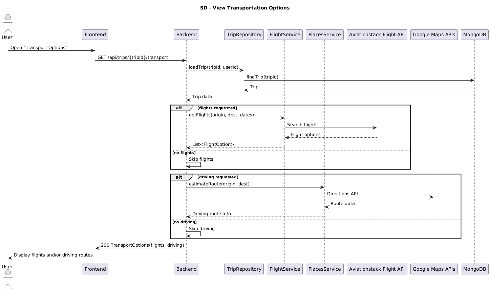

### UML State Diagram
This state diagram shows the Trip planning life cycle, from drafting a plan to creating an itinerary, and finally either saving or discarding it.

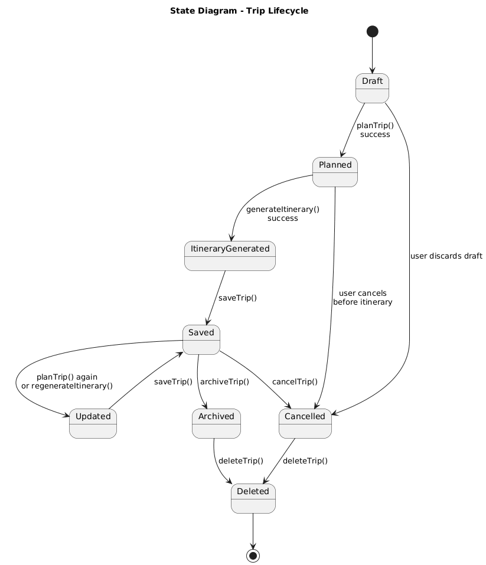

### UML Activity Diagram
The Activity Diagram demonstrates the flow of activity from the user to the front end and back end to plan a trip and generate an itinerary for the user.

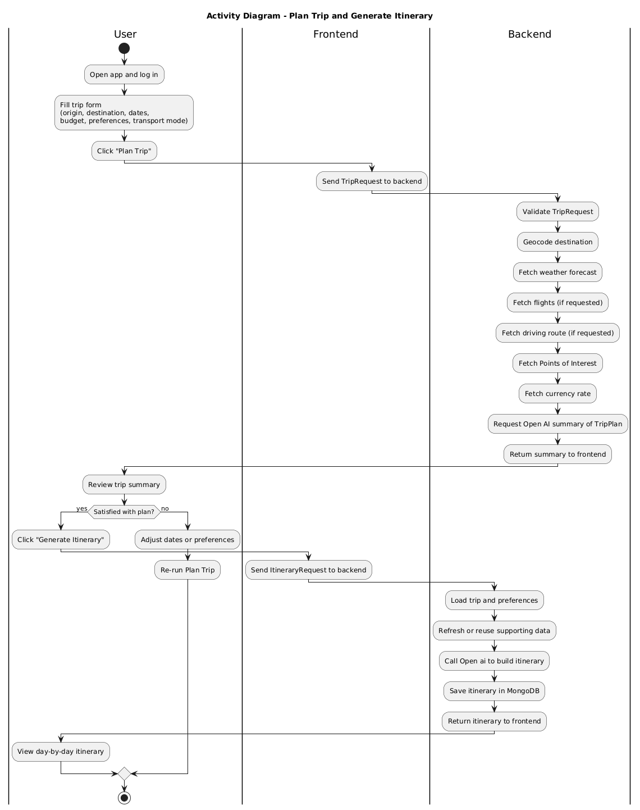

### UML Component Diagram
The system structure is broken up into four layers:

1.  A **frontend layer** containing the React web UI component.
2.  A **backend layer** representing the Python Fast Api and its controller and services components.
3.  A **database layer** containing the MongoDB database.
4.  An **external Api layer** housing the external Google api (Maps and Oath) and OpenAI APIs, Aviationstack Api, Exchange rate Api, and Open Weather Api.

The component structure shows how each component interacts using provided and required interfaces. It also shows how the system could later be broken down into a microservice architecture by separating each service into its own respective service Api.

* 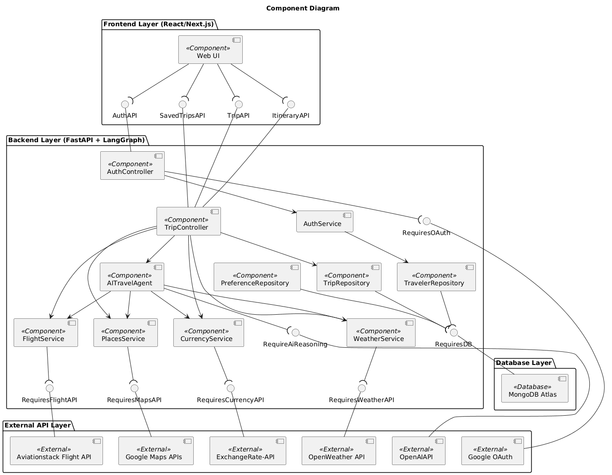

### Cloud Deployment Diagram
The deployment architecture uses Google Cloud hosting services:

* The **React frontend** is hosted on Firebase.
* The **Python FastAPI Docker image** runs on Google Cloud Run.
* The **Google Cloud Platform** includes Google APIs such as OAuth and Google Maps platform APIs (geocoding, and the Places API).

This setup allows for secure communication over **HTTPS on port 443**. The backend communicates with **MongoDB Atlas** using **TLS encryption** and also uses **HTTPS on port 443** to communicate with the **OpenAI API** and other external apis.

The chosen deployment pattern is **rolling deployment**, which gradually shifts traffic from the old version to the new one when a new version is deployed. This results in zero downtime, and any issues allow for a rollback to the previous Docker image. This works well with the Google Cloud Run revision systems.

* 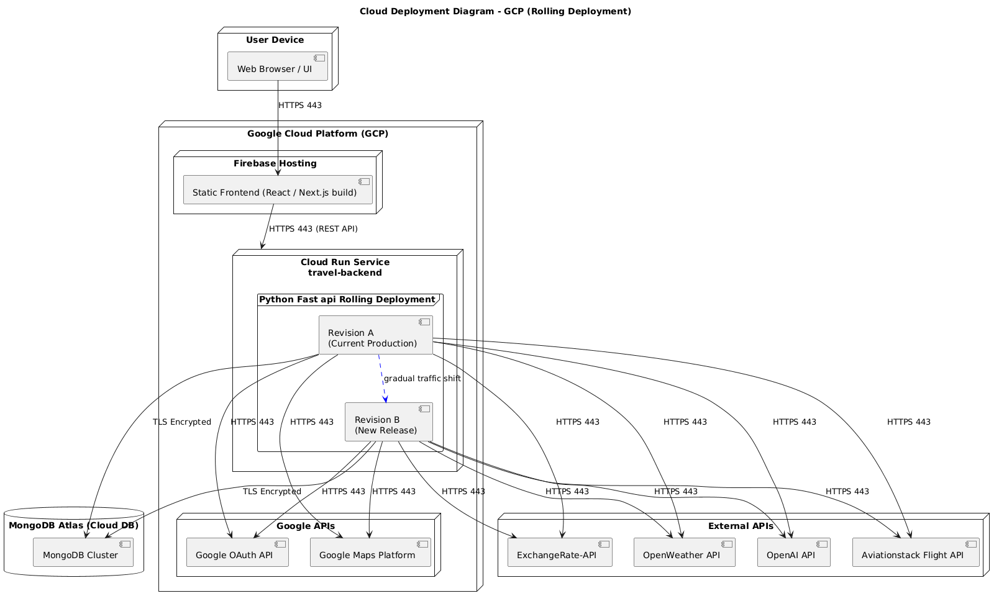

--

## Skeleton Classes
The skeleton classes can be found in the Skeleton_Classes folder

---

## Database Structure

Since this system uses MongoDB, a NoSQL database, the following data structure is in document format.

### Collection: `User`

| Field Name | Type |
| :--- | :--- |
| `UserId` | String – the google oauth user ID |
| `Name` | String – user display name |
| `Email` | String – user email address |
| `CreatedAt` | DateTime – timestamp of initial account creation |

### Collection: `preferences`

| Field Name | Type |
| :--- | :--- |
| `Id` | ObjecId |
| `userid` | String - References userId in users |
| `Description` | String – ex. “I like eat at local restaurants when traveling ” |

### Collection: `trips`

| Field Name | Type |
| :--- | :--- |
| `tripId` | String - Unique trip identifier |
| `UserId` | String - References userId in users |
| `origin` | String - Starting location (city/airport) |
| `destination` | String - Destination location (city/airport) |
| `start Date` | Date - Beginning of trip |
| `end Date` | Date - End of trip |
| `budget` | Number - estimated spending |
| `Home Currency` | String - e.g., "USD" |
| `DestinationCurrency` | String - e.g., "EUR" |
| `TransportMode` | String -"flight", "driving", or "both" |
| `CreatedAt` | DateTime - Timestamp of creation |
| `status` | String -"planned", "in-progress", "completed" |
| `planSummary` | String—summary Includes weather, transport, POIs, currency rate, and AI summary (aiNotes) |

### Collection: `itineraries`

| Field Name | Type |
| :--- | :--- |
| `itineraryId` | String - References itineraryId in itineraries |
| `tripId` | String - Unique trip identifier |
| `summary` | String- overall summary |
| `CreatedAt` | DateTime - Timestamp of creation |

### Collection: `itineraries Days`

| Field Name | Type |
| :--- | :--- |
| `Id` | ObjecId |
| `itineraryId` | String - References itineraryId in itineraries |
| `dayNumber` | Integer – day 1 |
| `Date` | Date – calendar date |
| `WeatherSummary` | String - Key weather info for that day |
| `notes` | String - AI-generated notes / explanations |
| `CreatedAt` | DateTime - Timestamp of creation |

### Collection: `weather forecast`

| Field Name | Type |
| :--- | :--- |
| `Id` | ObjecId |
| `tripId` | String -Unique trip identifier |
| `date` | Datetime - Forecast date |
| `tempHigh` | String - High temperature (°F/°C) |
| `tempLow` | String - High temperature (°F/°C) |
| `condition` | String - Summary (“Clear”, “Rain”, etc.) |
| `precipChance` | String - Chance of precipitation (0–1.0) |

### Collection: `Flight Option`

| Field Name | Type |
| :--- | :--- |
| `Id` | ObjecId |
| `tripId` | String -Unique trip identifier |
| `carrier` | String - Airline name |
| `flightNumber` | String Flight number |
| `depatureTime` | DateTime - Datetime of departure |
| `arrivalTime` | String Datetime of arrival |
| `price` | String Flight price |

### Collection: `route Estimates`

| Field Name | Type |
| :--- | :--- |
| `Id` | ObjecId |
| `tripId` | String - Unique trip identifier |
| `mode` | String - driving, walking, or transit |
| `durationMinutes` | String Total travel duration |
| `distanceKm` | String Distance in kilometers |

### Collection: `Point of interest`

| Field Name | Type |
| :--- | :--- |
| `Id` | ObjecId |
| `tripId` | String - Unique trip identifier |
| `name` | String - Point of interest name |
| `type` | String - Category (landmark, restaurant, museum, etc.) |
| `rateing` | String- Rating score |
| `address` | String- Street or formatted address |

### Collection: `currencyRates`

| Field Name | Type |
| :--- | :--- |
| `Id` | ObjecId |
| `tripId` | String - Unique trip identifier |
| `baseCurrency` | String - base currency |
| `targetCurrency` | String - Destination currency |
| `rate` | Float - Conversion rate at retrieval time |
| `retrievedAt` | Timestamp when the rate was fetched |

---

## Design Patterns and Strategies

### GRASP

* **Controller**: The backend uses controllers like `TripController` and `AuthController` to handle operations (e.g., `planTrip`, `generateItinerary`, `login`) and coordinate with the UI.
* **Low coupling/ high cohesion**: Each service (`WeatherService`, `FlightService`, `PlanService`, `Currency Service`) is responsible for a single external API, reducing coupling and keeping responsibilities focused.
* **Pure fabrication and indirection**:
    * `OpenAIService` is a pure fabrication, hiding OpenAI details from the AI travel agent.
    * `TripRepository` and `PreferenceRepository` act as an indirection layer to MongoDB Atlas.

### SOLID

* **Single Responsibility Principle**: `AITravelAgent` is responsible for AI reasoning using Lang Graph/OpenAI, while controllers handle HTTP, and services handle external data retrieval.
* **Dependency Inversion Principle**: Controllers depend on services and repositories instead of concrete implementations, making it easier to test and swap APIs.

### External service Strategy

* External services (Weather, flight, maps, currency, and OpenAI access) are implemented as **adapter classes** that translate between the external API contract and internal domain structures.

### References
[1] “The Accurate & Reliableexchange Rate Api,” ExchangeRate, https://www.exchangerate-api.com/ (accessed Dec. 5, 2025). 

[2]“Free, real-time Flight Status & Global Aviation Data API,” Aviationstack, https://aviationstack.com/ (accessed Dec. 5, 2025).   

[3] OpenWeatherMap.org, “Weather API,” OpenWeatherMap, https://openweathermap.org/api (accessed Dec. 5, 2025).  

[4] “Google Maps Platform,” Google Cloud, https://cloud.google.com/maps-platform (accessed Dec. 5, 2025).  

[5] “MongoDB Atlas: The global cloud database for modern applications,” MongoDB, https://www.mongodb.com/atlas/database (accessed Dec. 5, 2025).